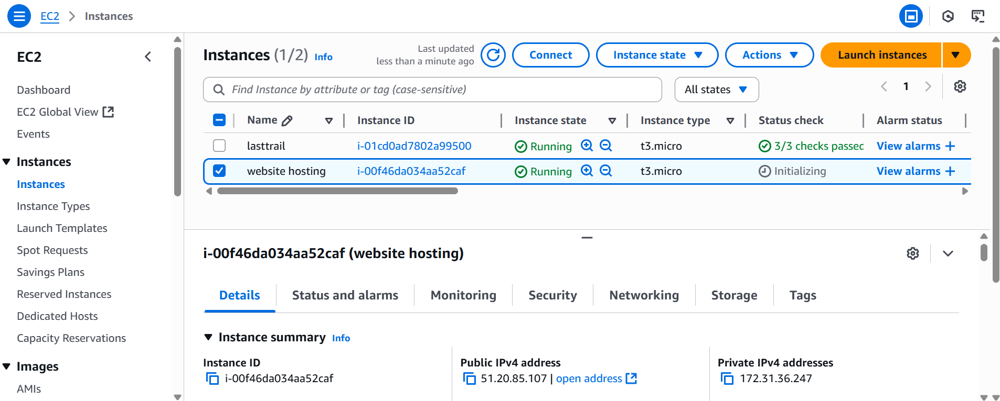

# The Future of AI-Powered Trading Technology

### NAME: Ogbuinya Johnmark Chisom  
### ALTSCHOOL ID: ALT/SOE/024/1754

---

## 📌 Project Description

This project, led by Ogbuinya Johnmark—a Cloud Engineering student at AltSchool and a medical student at UNN—aims to build an AI-powered trading platform that addresses financial challenges through smart, accessible technology.

Combining my skills in trading, programming, and cloud infrastructure (AWS), the goal is to deliver lasting value to individuals and society by promoting financial empowerment through innovation.

---

## 🌐 Live Demo

- **Public IP**: [http://51.20.85.107](http://51.20.85.107)  
- **Secure HTTPS**: [https://tradingai.jumpingcrab.com](https://tradingai.jumpingcrab.com)

---

## 🛠️ Technologies Used

- AWS EC2 (Ubuntu 24.04)
- FreeDNS
- Nginx
- Tailwind CSS (via CDN)
- Git & GitHub
- Certbot (Let's Encrypt SSL)

---

## ✅ Steps Taken to Complete the Project

1. **Landing Page Creation**  
   Created a dynamic landing page using HTML and Tailwind CSS.

2. **EC2 Instance Setup**  
   Launched an EC2 instance on Ubuntu 24.04, enabling HTTP and HTTPS.  
   Screenshots:  
     
     
   

3. **Connecting to EC2 and Installing Nginx**  
   Accessed the instance via SSH and installed Nginx.  
   - **Before Nginx Installation**:  
       
   - **After Nginx Installation**:  
     

4. **Git Repository Clone**  
   Cloned my GitHub repository directly in the EC2 terminal.  
   

5. **Deploying the Web Page**  
   Replaced the default Nginx HTML file with my custom HTML file.  
   

6. **Subdomain Creation with FreeDNS**  
   Created a subdomain using FreeDNS.  
   

7. **Securing the Subdomain with Certbot**  
   - **Before SSL**:  
       
   - **After SSL Installation**:  
     

---

## ⚠️ Problems Encountered

- Could not install Tailwind CSS locally, so I used the CDN from the official website.
- Faced network issues while trying to host the site.
- Made a mistake with the same email during SSL certification, causing delays.
- Encountered issues pushing files via HTTPS; switched to SSH instead.

---

## 🙏 Acknowledgment

I give all glory to God for the success of this project and for granting me the opportunity to be a student at AltSchool through the support of my beloved sister.

---

    
  
